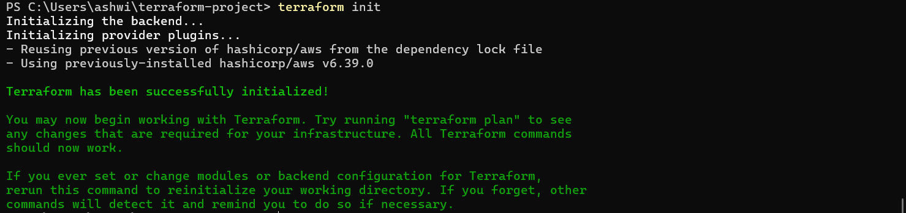
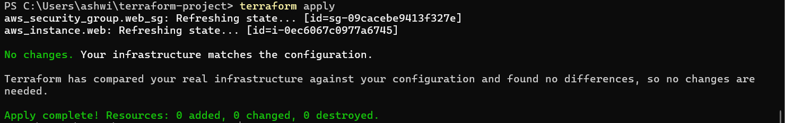
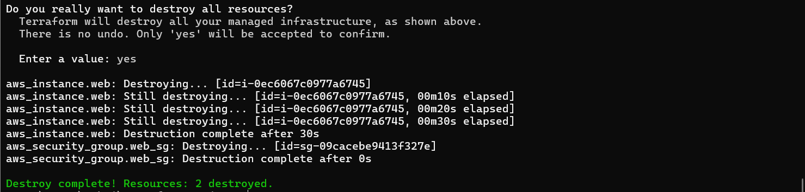

#  Terraform AWS Infrastructure Automation

##  Overview

This project demonstrates **Infrastructure as Code (IaC)** by provisioning AWS resources using Terraform. It automates the deployment of an EC2 instance along with security configurations in a clean and reproducible way.

---

##  Features

*  Automated infrastructure provisioning using Terraform
*  EC2 instance deployment on AWS
*  Security group configuration (SSH + HTTP access)
*  Declarative infrastructure management
*  Easy cleanup using `terraform destroy`

---

##  Tech Stack

* **Terraform**
* **AWS (EC2, VPC, Security Groups)**
* **CLI (AWS CLI + PowerShell)**

---

##  Project Structure

```
terraform-project/
│
├── main.tf
├── screenshots/
│   ├── init.png
│   ├── apply.png
│   └── destroy.png
└── README.md
```

---

##  How to Run

###  Initialize Terraform

```bash
terraform init
```

###  Preview Changes

```bash
terraform plan
```

###  Apply Configuration

```bash
terraform apply
```

###  Destroy Resources (Important 💀)

```bash
terraform destroy
```

---

## 📸 Screenshots

### 🔹 Terraform Init



### 🔹 Terraform Apply



### 🔹 Terraform Destroy



---

##  Key Learnings

* Infrastructure as Code (IaC) concepts
* AWS resource provisioning using Terraform
* Handling real-world issues (VPC limits, subnet errors, instance compatibility)
* Debugging and fixing cloud deployment errors
* Managing cloud costs using resource cleanup

---

##  Outcome

Successfully built a **production-like infrastructure automation workflow**, demonstrating real-world DevOps practices using Terraform and AWS.

---

##  Author

Ashwin Poojary


**Ashwin Poojary**
